# PLL Design and Verilog-A Behavioral Modeling Lab Report

## 1. PFD Verilog-A Model

```verilog
// AMS PLL Project: Phase Frequency Detector (PFD)
`include "constants.vams"
`include "disciplines.vams"

// REF: Reference signal
// FB: Feedback signal
// UP: Up signal (FB late)
// DN: Down signal (FB early)

module PFD(REF,FB,UP,DN);
	// VDD and threshold voltage for digital signals
	parameter real VDD = 1.2;
	parameter real thresh = 0.6;
	// rise/fall/delay times of PFD output
	parameter real trise = 10p, tfall = 10p, td = 0;
	input REF,FB;
	output UP,DN;

	electrical REF,FB,UP,DN;

	// Internal UP and DN signals
	real DN_i, UP_i;
	analog begin
		// Check DN_i state when REF arrives

		@(cross(V(REF)-thresh,1))
			if(DN_i < thresh) begin
				// *** add line here ***
				UP_i = VDD;
				DN_i = 0;
			end
			else begin
				UP_i = 0;
				DN_i = 0;

			end

		// Check UP_i state when FB arrives

		@(cross(V(FB)-thresh,1))
			if(UP_i < thresh) begin
				DN_i = VDD;
			end
			else begin
				UP_i = 0;
				DN_i = 0;
			end
		V(UP) <+ transition(UP_i,td,trise,tfall);
		V(DN) <+ transition(DN_i,td,trise,tfall);
	end
endmodule

```

<!-- pagebreak -->


## 2. PFD Testbench Results

### Leading FB

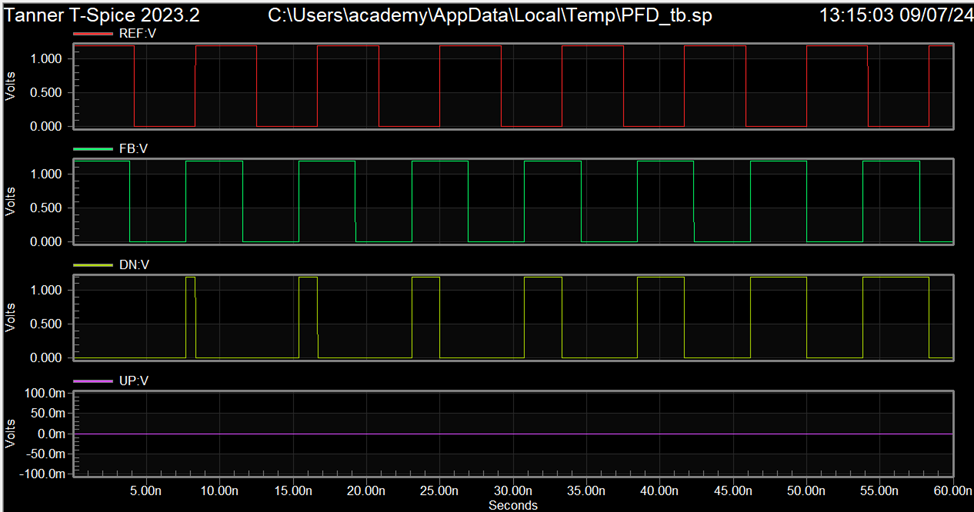

### Same Frequency (Fref = Ffb)


### Lagging FB


*Figure: PFD operation (similar to Fig. 6.13 and Fig. 6.14 in the reference)*

<!-- pagebreak -->

## 3. CHP Verilog-A Model

```verilog
// AMS PLL Project: Charge Pump (CHP)
`include "constants.vams"
`include "disciplines.vams"
// UP: Up signal
// DN: Dn signal
// IOUT: CHP current output
// Since the output is current, IOUT cannot be left unconnected (o.c.) in the testbench

module CHP(UP,DN,IOUT);
	input UP,DN;
	inout IOUT;
	electrical UP,DN,IOUT;
	// ichp: CHP current
	parameter real ichp = 10u from [0:inf);
	// Threshold voltage for digital signals
	parameter real thresh=0.6;
	// rise/fall/delay times of CHP output
	parameter real trise=10p, tfall=10p, td=0;

	// Internal variable for CHP output current

	real IOUT_i = 0;
	analog begin
		// Generate events at UP and DN transitions
		@(cross(V(UP) - thresh, 0));
		@(cross(V(DN) - thresh, 0));
		if ((V(UP) > thresh) && (V(DN) < thresh))
			IOUT_i = -ichp;
		else if ((V(DN) > thresh) && (V(UP) < thresh))
			IOUT_i = ichp;
		else
			IOUT_i = 0;
		I(IOUT) <+ transition(IOUT_i,td,trise,tfall);
	end
endmodule
```

<!-- pagebreak -->

## 4. CHP Testbench Results

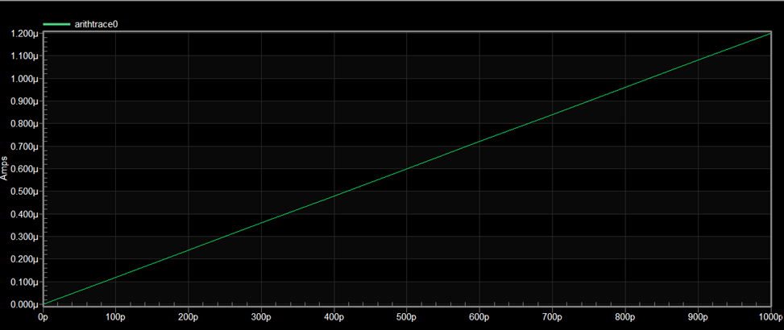

*Figure : CHP operation (similar to Fig. 6.18 in the reference)*

> Note: We swept for only 1n delay as it make sense that the delay won't be more than that

<!-- pagebreak -->

## 5. VCO Verilog-A Model

```verilog
// AMS PLL Project: Voltage Controlled Oscillator (VCO)
`include "constants.vams"
`include "disciplines.vams"

module VCO(VCTRL,VOUT);
	parameter real VHIGH = 1.2;
	parameter real Vmin=0.2;
	parameter real Vmax=1 from (Vmin:inf);
	parameter real Fmin=0.5G from (0:inf);
	parameter real Fmax=1.5G from (Fmin:inf);
	parameter real trise=10p, tfall=10p, td=0;
	input VCTRL;
	output VOUT;
	voltage VCTRL,VOUT;
	real freq;
	real phase;
	real sine;
	real VOUT_i;

	analog begin
		// compute the freq from the input voltage
		freq =((V(VCTRL) - Vmin)*(Fmax - Fmin) / (Vmax - Vmin)) + Fmin;
		// bound the frequency
		if (freq < Fmin) freq = Fmin;
		if (freq > Fmax) freq = Fmax;
		phase = 2 * `M_PI * idtmod(freq,0,1,-0.5);
		// generate the output
		sine = sin(phase);
		@(cross(sine,0))
			;
		if (sine > 0)
			VOUT_i = VHIGH;
		else

			VOUT_i = 0;
		V(VOUT) <+ transition(VOUT_i,td,trise,tfall);
		// bound the time step

		$bound_step(1 / (freq * 100));
	end
endmodule
```
<!-- pagebreak -->

## 6. VCO Testbench Results


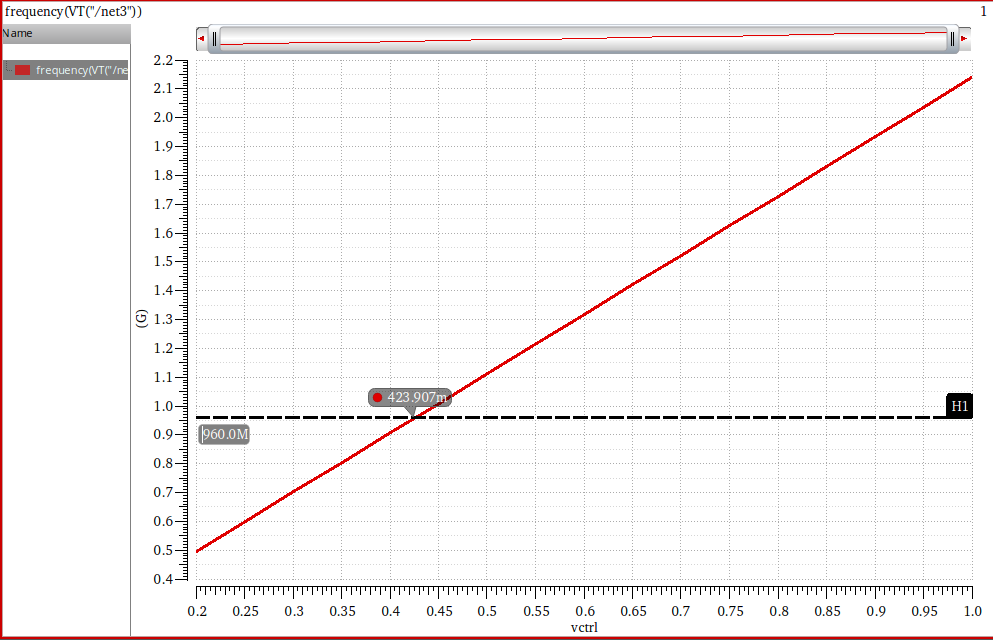
*Figure : VCO operation (similar to Fig. 6.11 in the reference)*

<!-- pagebreak -->

## 7. Divider Verilog-A Model

```verilog
// AMS PLL Project: Frequency Divider
`include "constants.vams"
`include "disciplines.vams"

module Divider(VIN,VOUT);

	output VOUT; voltage VOUT;	// output
	input VIN; voltage VIN;		// input (edge triggered)
	parameter real vh=1.2;		// output voltage in high state
	parameter real vl=0;		// output voltage in low state
	parameter real vth=0.6;	// threshold voltage at input
	parameter integer ratio=8 from [2:inf);	// divider ratio
	parameter real tt=10p from (0:inf);	// transition time of output signal
	parameter real td=0 from [0:inf);	// average delay from input to output

	// *** add line here ***
	real count=0;
	real out_value=0;

	analog begin

    	@(cross(V(VIN) - vth, 1)) begin
			if (count==floor(ratio/2))
				out_value = vh;

			if (count == floor(ratio))begin
				out_value = vl;
				count = 0;
			end

			count = (count + 1);
   	end

 	   V(VOUT) <+ transition(out_value, td, tt);

	end
endmodule


```
<!-- pagebreak -->

## 8. Divider Testbench Results (Verilog-A)
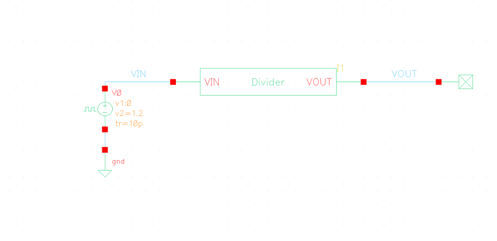

*Figure : Divider operation using Verilog-A model (similar to Fig. 6.20 in the reference)*

<!-- pagebreak -->

## 9. Transistor-Level Divider Design

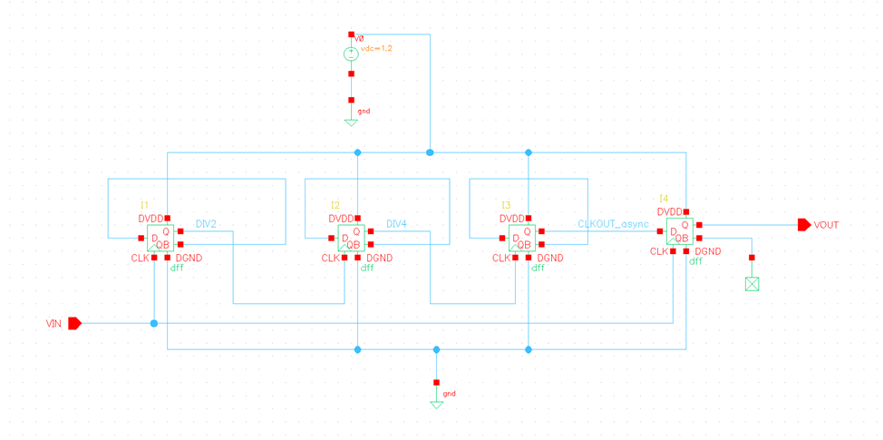
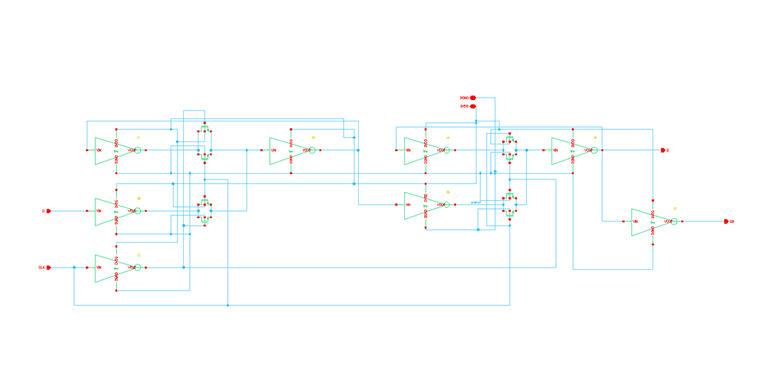
*Figure : Transistor-level schematic of the DFF used in the divider design*

<!-- pagebreak -->

## 10. Transistor-Level Divider Testbench Results


*Figure : Divider operation using transistor-level design (similar to Fig. 6.20 in the reference)*

<!-- pagebreak -->

## 11. Complete PLL Simulation (Verilog-A Models) (VCTRL)

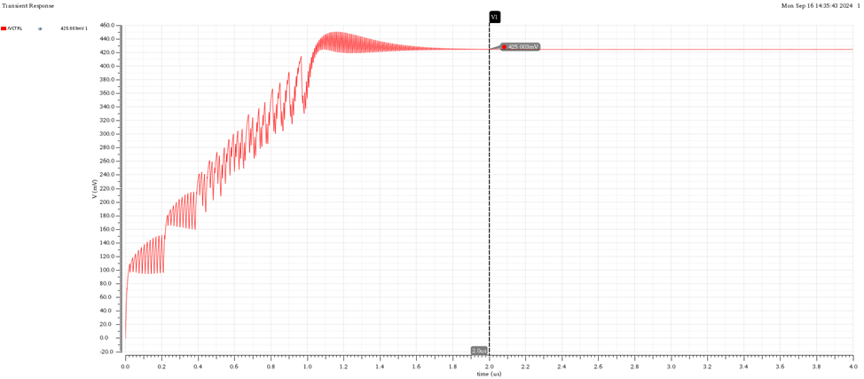
*Figure : VCO control voltage (similar to Fig. 6.7 in the reference)*
> Vctrl @ lock = 0.425mV

<!-- pagebreak -->

## 12. Analytical Calculation of Control Voltage at Lock

The equation for \( K_{vco} \) is:

\[
K_{vco} = \frac{f_{\text{out}} - f_{\text{min}}}{V_{\text{ctrl}} - V_{\text{min}}}
\]

The equation for \( V_{\text{ctrl}} \) is:

\[
V_{\text{ctrl}} = \frac{f_{\text{out}} - f_{\text{min}}}{K_{vco}} + V_{\text{min}}
\]

Given that:

\[
V_{\text{ctrl}} = 0.4244
\]

## 13. Comparison of Simulated vs. Calculated Control Voltage

|       | Simulated Value | Calculated Value |
|:-----:|:---------------:|:----------------:|
| VCTRL |     0.4244      |      0.425       |

> Comment: The two results match each other.

<!-- pagebreak -->

## 14. Complete PLL Operation (Verilog-A Models) (ALL SIGNALS)

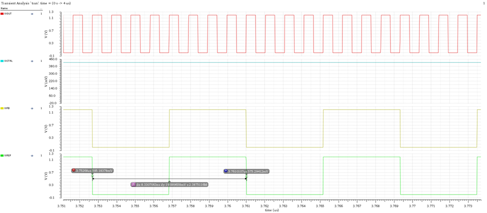

*Figure : PLL operation (similar to Fig. 6.8 in the reference)*

> Period of Ref: 8.33n
> Period of VOUT: 1.0412n

<!-- pagebreak -->

## 15. Simulation Log (Verilog-A Models)


## 16. Updated Hierarchy with Schematic Divider


*Figure : Configuration in hierarchy editor with schematic view of divider*

<!-- pagebreak -->

## 17. PLL Simulation with Transistor Level (Control Voltage)


*Figure : VCO control voltage with schematic divider (similar to Fig. 6.23 in the reference)*

> Note: Different to the one in pll document due to initial condition, we could achieve the same if we put IC on capacitor.


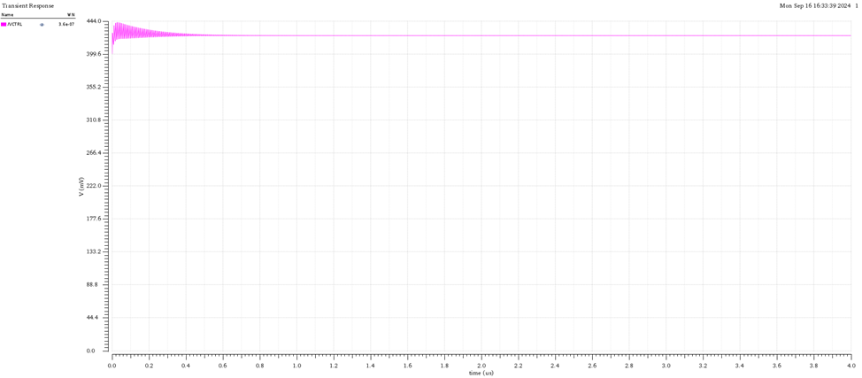

<!-- pagebreak -->

## 18. PLL Operation with Transistor Level Divider (ALL SIGNALS)


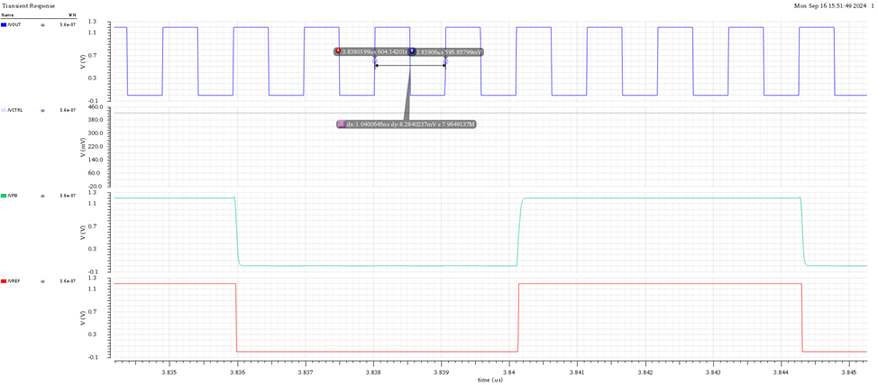
*Figure 11: PLL operation with schematic divider (similar to Fig. 6.24 in the reference)*

> Period of Ref: 8.33n
> Period of VOUT: 1.04n

<!-- pagebreak -->

## 19. Simulation Log (with Schematic Divider)

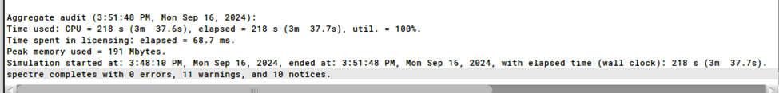

## 20. Simulation Time Comparison

|                 | Behavioral  |     Transistor Level     |
|:---------------:|:-----------:|:------------------------:|
| Simulation Time | 7.9 Seconds | 3 Minutes and 38 Seconds |

> Comment: There is a huge difference between the Transistor level simulation and Behavior level simulation results, we can see the advantage of simulating complex systems using top-down methodology with behavioral models to decrease simulation time and verify that the system will work before implementing and wasting time on something that will not work and not achievable.
